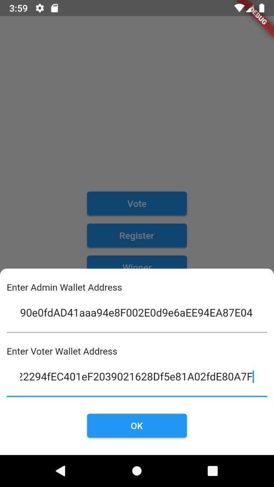
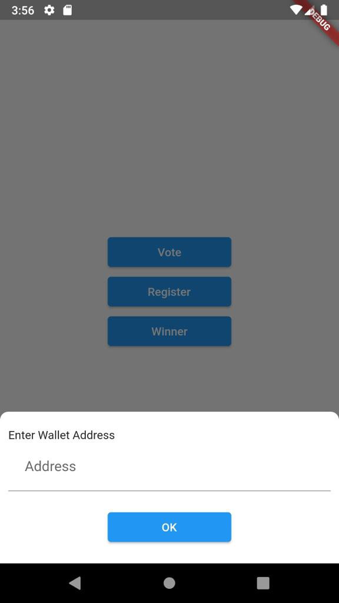
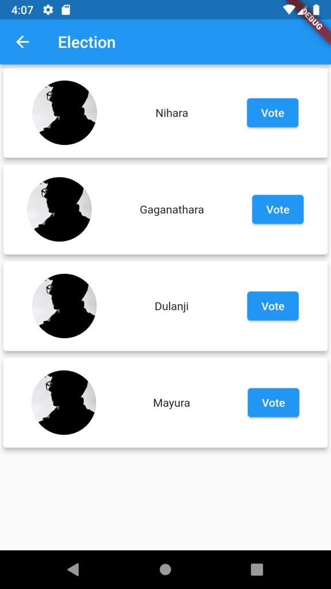

## Smart Contract Voting Application

Voting application using smart contract. 

### Environment

- Flutter
- Truffle
- Ganache
- Ethereum Blockchain

<br>


## ScreenShot

&nbsp;&nbsp;&nbsp;&nbsp;


## Development Environment
Clone the repository and run the following commands:
```
flutter pub get
flutter run
```

Config Following files according to your Ganche Environment

truffle-config.js 
lib/contract_data.dart 

And run the following commands:

```
truffle migrate

```

## Links

* [Repo](https://github.com/nihara96/flutter_voting_app.git)

